# 🏗️ Sabi-Hub Architecture

## 1. High-Level Overview

The **Sabi-Hub** architecture is a modular security ecosystem where **Authentication** (`@stefanasemota/sabi-auth`) and **Logging** (`@stefanasemota/sabi-logger`) operate as standalone, decoupled entities. This design allows consuming applications (like **NaijaSpeak**) to plug in security features without tight coupling to specific implementation details.

## 2. Component Flow

Data flows from the user through the application to the security layer and finally to the immutable audit log.

```mermaid
graph TD
    User(["👤 User"]) -->|Interacts| NS["📱 NaijaSpeak (Next.js 15)"]
    NS -->|Calls| SA["🔐 Sabi-Auth"]
    SA -->|Validates Session| SA
    SA -->|Emits Event| SL["📜 Sabi-Logger"]
    SL -->|Writes Immutable Log| SH["🛡️ Security Hub"]
```

## 3. Security Model

### httpOnly Cookies
We exclusively use **`httpOnly`, `Secure`, `SameSite=Lax`** cookies for session management. This prevents XSS attacks from accessing session tokens via JavaScript. The browser handles cookie storage and transmission automatically.

### Segregated Audit Logs
**sabi_audit_logs** are stored in a **completely separate Firebase project** ("Security Hub").
*   **Why?** Even if the main application's database is compromised or an admin goes rogue, the audit trail remains immutable and tamper-proof in a different environment with restricted write-only access.

## 4. Dependency Logic & Build System

### Transpile Packages
Since our libraries are written in TypeScript and ship as modern ESM, consuming Next.js applications must use `transpilePackages` in `next.config.js`.
*   **Reason**: This ensures the raw source code from `node_modules` is correctly compiled by the consuming app's build pipeline, preventing "Unexpected token" errors with modern syntax.

### Internal Singletons
To prevent connection leaks and "Firebase App already exists" errors in serverless environments (like Vercel), we strictly manage Firebase Admin instances as **internal singletons**.
*   We check `getApps().length` before initializing.
*   We reuse the existing instance if available.
*   This ensures a single, stable connection pool per serverless function invocation.
